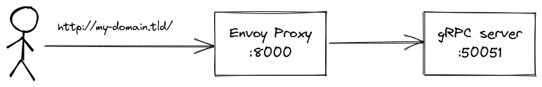

# gRPC-web with Envoy Proxy

This is a minimal example repo to demonstrate the following architecture, inspired by [this question on StackOverflow](https://stackoverflow.com/questions/71425098/connect-nginx-proxy-to-envoy-for-grpc-web), but **without NGINX** (see `main` branch for the example with NGINX):



## Run

To run the stack, just run:

```
docker-compose up
```

Then, in a browser, open [`http://localhost:8081`](http://localhost:8081) (the client using gRPC-web to call Envoy).

You should see:

```
Response :

Hello World!
```

`Hello World!` is the response sent by the gRPC server. `World` is the parameter sent to the request (see [client.js](./client.js)).
